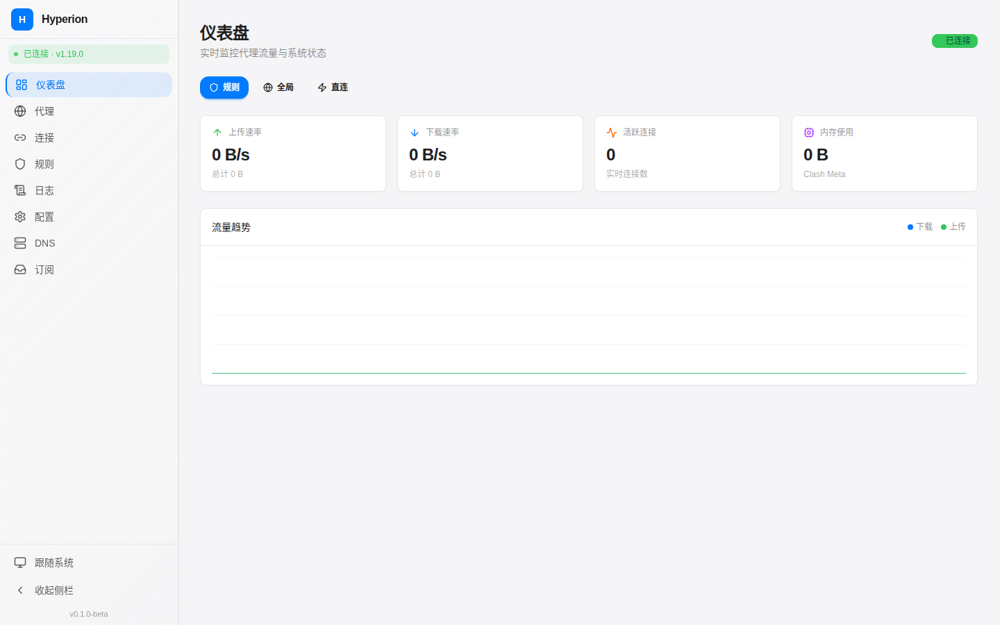
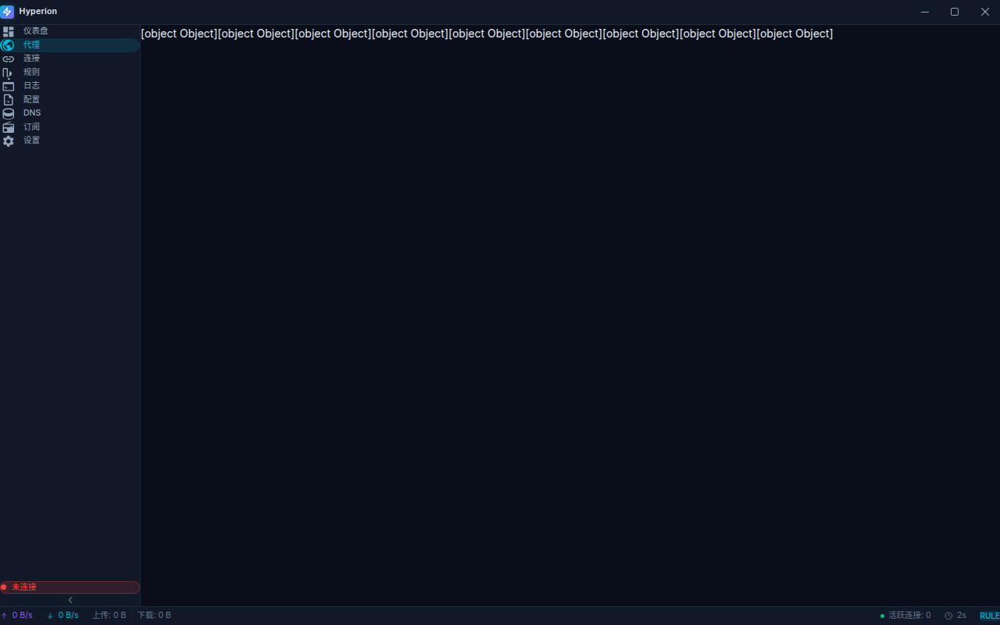
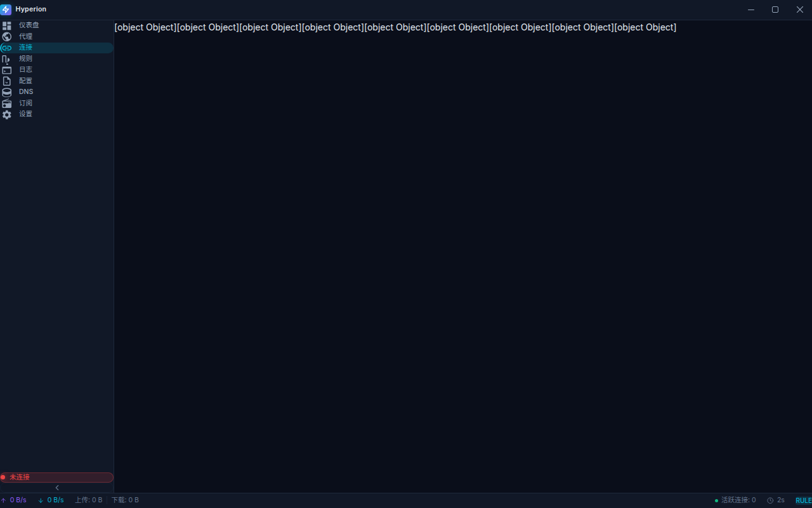
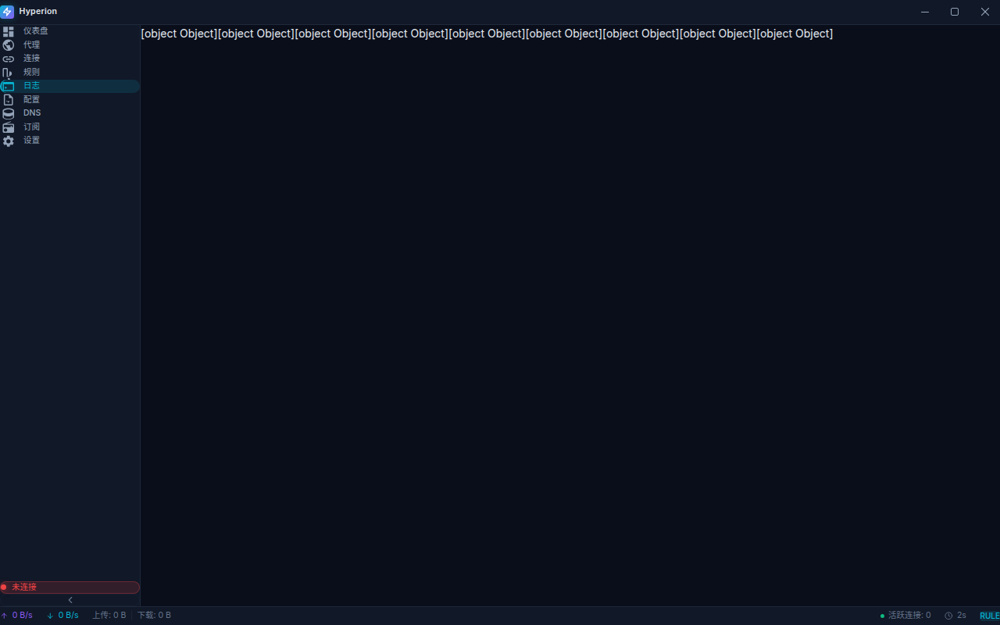

<div align="center">


# Hyperion

**Hyperion — 新一代 Clash 内核网页前端**

基于 **SolidJS + Vite + TypeScript** 打造的高性能、现代化代理管理工具

[](https://github.com/Qing060325/Hyperion/releases)
[](LICENSE)
[](https://www.solidjs.com/)
[](https://vitejs.dev/)
[](https://www.typescriptlang.org/)

---

</div>

> **Hyperion（海珀利昂）** — 取自希腊神话中的光明泰坦神，象征光芒与力量。
> 以暗黑科技美学为设计语言，为 Clash 代理内核提供最极致的可视化管理体验。

---

## 🎉 v0.3.0 新功能

| 功能 | 说明 |
|------|------|
| 🚀 **欢迎向导** | 首次启动引导，自动检测 Clash 内核，一键配置 |
| 📝 **规则编辑器** | 可视化规则编辑，支持拖拽排序、批量导入导出 |
| 🎯 **策略组拖拽** | 节点拖拽排序，可视化调整策略组顺序 |
| 📁 **多配置管理** | 支持多配置文件切换、导入导出、远程更新 |
| 🌐 **网络模式** | TUN 模式开关、系统代理配置 |
| 🗺️ **连接详情** | IP 地理定位、连接详情面板、主动断开 |
| 🔍 **日志过滤** | 多条件过滤、日志导出 (TXT/JSON/CSV) |
| 🎨 **主题系统** | 多款内置主题，深色/浅色模式切换 |
| ⌨️ **快捷键** | 全局快捷键系统，可自定义绑定 |
| 🔔 **通知系统** | 连接错误、订阅到期、新版本通知 |

---

## 功能总览

### 仪表盘

| 功能 | 说明 |
|------|------|
| 实时流量图表 | Canvas 绘制的平滑曲线，双通道（上传/下载）辉光特效 |
| 速率监控 | 实时上传/下载速率，精确到字节级 |
| 系统统计 | 活跃连接数、内存使用、运行时间统计卡片 |
| 模式切换 | 一键切换规则模式 / 全局模式 / 直连模式 |

### 代理管理

| 功能 | 说明 |
|------|------|
| 代理组树 | 可折叠的代理组层级结构 |
| 节点卡片 | 名称、协议类型标签、实时延迟显示 |
| 延迟指示器 | 五级颜色编码：🟢 优秀(≤100ms) / 🔵 良好(≤300ms) / 🟡 一般(≤500ms) / 🔴 较差(>500ms) / ⚪ 未知 |
| 延迟测试 | 单节点测试 / 全部测试 / 右键快速测速 |
| 搜索过滤 | 按节点名称实时搜索 |
| 代理集管理 | Proxy Provider 健康检查与更新 |

### 连接管理

| 功能 | 说明 |
|------|------|
| 实时连接表 | WebSocket 驱动的实时连接列表 |
| 多维排序 | 按主机/进程/规则/下载/上传排序 |
| 精确过滤 | 按域名、进程名、规则、链路关键词过滤 |
| 连接控制 | 单条关闭 / 批量关闭全部 |
| 速率显示 | 每条连接的实时上传/下载速率 |
| 链路可视化 | 代理链路完整展示（如 `HK01 → JP03 → 目标`） |

### 规则管理

| 功能 | 说明 |
|------|------|
| 规则列表 | 按类型着色标签的规则表（DOMAIN / IP-CIDR / GEOSITE 等） |
| 全文搜索 | 按规则类型、匹配内容、策略搜索 |
| 规则集 | Rule Provider 管理与一键更新 |
| 规则统计 | 实时显示规则总数与命中信息 |

### 日志

| 功能 | 说明 |
|------|------|
| 实时日志流 | WebSocket 推送的实时日志 |
| 级别过滤 | Debug / Info / Warning / Error 四级过滤 |
| 日志搜索 | 关键词搜索日志内容 |
| 滚动控制 | 自动滚动开关、暂停/继续、清空 |

### 配置管理

| 功能 | 说明 |
|------|------|
| 重载配置 | 一键重载 Clash 配置文件 |
| 更新数据库 | 更新 GeoIP / GeoSite 数据库 |
| 重启内核 | 安全重启 Clash Meta 内核 |
| 代理集列表 | 查看/更新所有 Proxy Provider |
| 配置信息 | 端口、模式、TUN、IPv6 等完整信息展示 |

### DNS 工具

| 功能 | 说明 |
|------|------|
| DNS 查询 | 支持 A / AAAA / CNAME / TXT / MX / NS 记录查询 |
| 查询结果 | 显示状态码、TTL、解析 IP 等详细信息 |
| Fake-IP 缓存 | 一键清除 Fake-IP 缓存解决 DNS 异常 |

### 订阅管理

| 功能 | 说明 |
|------|------|
| 订阅增删 | 添加 / 编辑 / 删除订阅链接 |
| 启用控制 | 单独启用/禁用每个订阅 |
| 流量显示 | 已用/总流量进度条可视化 |
| 批量更新 | 一键更新全部订阅 |

### 系统设置

| 分类 | 功能 |
|------|------|
| **通用** | 语言切换（中文/英文）、开机自启、静默启动、最小化到托盘 |
| **连接** | API 地址、端口、密钥配置 |
| **外观** | 暗色 / 亮色 / 跟随系统 三种主题 |
| **网络** | 系统代理、TUN 模式、允许局域网、运行模式、日志级别 |
| **关于** | 版本信息、Clash Meta 版本、项目介绍 |

---

## 界面预览

### 仪表盘



*实时流量趋势图 + 系统统计卡片 + 运行模式切换*

### 代理管理



*代理组树状结构 + 节点卡片 + 延迟颜色编码*

### 连接管理



*实时连接表格 + 多维排序与过滤*

### 规则管理


*规则类型着色标签 + 规则集管理*

### 日志



*WebSocket 实时日志流 + 级别过滤*

### 配置管理


*配置操作 + Proxy Provider 管理*

### DNS 工具


*DNS 查询工具 + Fake-IP 缓存管理*

### 订阅管理


*订阅列表 + 流量进度条*

### 系统设置


*五分区设置（通用/连接/外观/网络/关于）*

---

## 技术架构

### 技术栈

| 层级 | 技术 | 说明 |
|------|------|------|
| **桌面框架** | Tauri 2.0 | Rust 核心，打包体积仅 3-5MB |
| **前端框架** | SolidJS 1.9 | 细粒度响应式，无 VDOM，极致渲染性能 |
| **开发语言** | TypeScript 5.7 + Rust | 全栈类型安全 |
| **路由** | @solidjs/router | SolidJS 官方路由方案 |
| **状态管理** | Solid.js Signals + Store | 原生响应式，零依赖 |
| **样式方案** | Tailwind CSS 4.0 | 原子化 CSS，按需生成 |
| **构建工具** | Vite 6 | 极速 HMR，毫秒级热更新 |
| **可视化** | Canvas API | 高性能实时流量图表 |
| **实时通信** | WebSocket | 三路复用（流量/日志/连接） |
| **国际化** | 自研 i18n | 中英文双语支持 |

### 项目结构

```
Hyperion/
├── src-tauri/                    # Tauri / Rust 后端
│   ├── src/
│   │   ├── main.rs              # 应用入口 + 系统托盘
│   │   ├── commands/            # Tauri IPC 命令
│   │   │   ├── config.rs        # 配置持久化
│   │   │   ├── proxy.rs         # 系统代理设置
│   │   │   ├── service.rs       # 服务模式管理
│   │   │   └── update.rs        # 自动更新
│   │   ├── clash/               # Clash 内核交互层
│   │   │   ├── client.rs        # HTTP API 客户端 + 类型定义
│   │   │   └── websocket.rs     # WebSocket 客户端
│   │   └── utils/
│   │       └── platform.rs      # 跨平台工具函数
│   ├── Cargo.toml
│   └── tauri.conf.json
│
├── src/                          # SolidJS 前端
│   ├── App.tsx                  # 根组件 + 路由配置
│   ├── main.tsx                 # 入口文件
│   ├── index.css                # 设计系统（CSS 变量 + 全局样式）
│   ├── pages/                   # 页面组件
│   │   ├── Dashboard.tsx        # 仪表盘
│   │   ├── Proxies.tsx          # 代理管理
│   │   ├── Connections.tsx      # 连接管理
│   │   ├── Rules.tsx            # 规则管理
│   │   ├── Logs.tsx             # 日志
│   │   ├── Configs.tsx          # 配置管理
│   │   ├── DNS.tsx              # DNS 工具
│   │   ├── Subscriptions.tsx    # 订阅管理
│   │   └── Settings.tsx         # 系统设置
│   ├── components/              # 通用组件
│   │   └── layout/              # 布局组件
│   │       ├── MainLayout.tsx   # 主布局
│   │       ├── TitleBar.tsx     # 自定义标题栏
│   │       ├── Sidebar.tsx      # 可折叠侧边栏
│   │       └── StatusBar.tsx    # 全局状态栏
│   ├── services/                # API 服务层
│   │   ├── clash-api.ts         # Clash RESTful API 封装
│   │   └── clash-ws.ts          # WebSocket 管理器
│   ├── stores/                  # 全局状态
│   │   ├── clash.ts             # Clash 连接状态
│   │   ├── theme.ts             # 主题状态
│   │   └── settings.ts          # 应用设置
│   ├── types/clash.ts           # TypeScript 类型定义
│   ├── i18n/                    # 国际化
│   │   ├── zh-CN.ts             # 中文
│   │   ├── en.ts                # 英文
│   │   └── index.ts             # i18n 工具
│   └── utils/                   # 工具函数
│       ├── format.ts            # 字节/速度/时间格式化
│       └── color.ts             # 延迟颜色映射
│
├── screenshots/                 # 界面截图
├── index.html
├── vite.config.ts
├── tsconfig.json
├── package.json
└── README.md
```

### Clash API 对接

Hyperion 通过 Clash RESTful API 和 WebSocket 与内核通信：

**RESTful API 端点**

| 方法 | 路径 | 功能 |
|------|------|------|
| GET | `/version` | 获取版本信息 |
| GET/PATCH | `/configs` | 读取/更新配置 |
| PUT | `/configs` | 重载配置 |
| POST | `/configs/geo` | 更新 GeoIP 数据库 |
| POST | `/restart` | 重启内核 |
| GET | `/proxies` | 获取代理列表 |
| PUT | `/proxies/{name}` | 切换代理节点 |
| GET | `/proxies/{name}/delay` | 测试节点延迟 |
| GET | `/rules` | 获取规则列表 |
| GET/DELETE | `/connections` | 获取/关闭连接 |
| GET | `/dns/query` | DNS 查询 |

**WebSocket 实时流**

| 端点 | 数据 | 说明 |
|------|------|------|
| `/traffic` | `{ up, down }` | 实时上传/下载速率 |
| `/logs` | `{ type, payload }` | 实时日志推送 |
| `/connections` | 连接详情 | 实时连接更新 |

---

## 设计系统

### 设计理念

Hyperion 采用 **暗黑科技风**（Dark Cyberpunk）设计语言，灵感来自游戏 HUD 和科幻界面：

- 深蓝黑底色，营造沉浸式科技氛围
- 青色（`#06b6d4`）+ 紫色（`#8b5cf6`）霓虹双色强调
- 玻璃拟态（Glassmorphism）半透明卡片
- 悬停时边框辉光（Glow-on-hover）微交互
- 自定义无边框窗口 + 原生窗口控件

### 配色方案

| 用途 | 色值 | 预览 |
|------|------|------|
| 背景主色 | `#0a0e1a` |  深蓝黑 |
| 背景次色 | `#111827` |  卡片背景 |
| 强调色 | `#06b6d4` |  青色 |
| 辅助强调 | `#8b5cf6` |  紫色 |
| 成功色 | `#10b981` |  绿色 |
| 警告色 | `#f59e0b` |  橙黄 |
| 错误色 | `#ef4444` |  红色 |

### 延迟颜色编码

| 延迟范围 | 颜色 | 说明 |
|----------|------|------|
| ≤ 100ms | 🟢 `#10b981` | 优秀 |
| ≤ 300ms | 🔵 `#06b6d4` | 良好 |
| ≤ 500ms | 🟡 `#f59e0b` | 一般 |
| > 500ms | 🔴 `#ef4444` | 较差 |
| 超时/无数据 | ⚪ `#475569` | 未知 |

---

## 快速开始

### 环境要求

| 依赖 | 最低版本 | 安装方式 |
|------|----------|----------|
| Node.js | 18+ | [nodejs.org](https://nodejs.org/) |
| pnpm | 8+ | `npm install -g pnpm` |
| Rust | 1.70+ | [rustup.rs](https://rustup.rs/) |
| Tauri 依赖 | — | [Tauri 前置条件](https://v2.tauri.app/start/prerequisites/) |

### 平台特定依赖

**Windows**
- WebView2（Windows 10 1803+ 已内置）
- Microsoft Visual Studio C++ Build Tools

**macOS**
- Xcode Command Line Tools：`xcode-select --install`

**Linux (Ubuntu/Debian)**
```bash
sudo apt update
sudo apt install libwebkit2gtk-4.1-dev \
  build-essential \
  curl \
  wget \
  file \
  libxdo-dev \
  libssl-dev \
  libayatana-appindicator3-dev \
  librsvg2-dev
```

### 安装与运行

```bash
# 1. 克隆仓库
git clone https://github.com/Qing060325/Hyperion.git
cd Hyperion

# 2. 安装前端依赖
pnpm install

# 3. 启动开发模式
pnpm tauri:dev

# 4. 构建发布版
pnpm tauri:build
```

构建产物位于 `src-tauri/target/release/bundle/`。

---

## 支持平台

| 平台 | 架构 | 最低版本 | 状态 |
|------|------|----------|------|
| Windows | x64 | Windows 10 | ✅ |
| macOS | x64 / Apple Silicon | macOS 10.15 | ✅ |
| Linux | x64 / ARM | 主流发行版 | ✅ |

> Hyperion 使用系统原生 WebView（而非打包 Chromium），因此打包体积极小（约 3-5MB），运行内存占用远低于 Electron 应用。

### 跨平台功能对照

| 功能 | Windows | macOS | Linux |
|------|---------|-------|-------|
| 自定义标题栏 | ✅ | ✅ | ✅ |
| 系统托盘 | ✅ | ✅ | ✅ |
| 系统代理设置 | ✅ 注册表 | ✅ networksetup | ✅ gsettings |
| TUN 模式 | ✅ Wintun | ✅ utun | ✅ TUN |
| 服务模式 | ✅ Windows Service | ✅ launchd | ✅ systemd |
| 开机自启 | ✅ 注册表 | ✅ Login Items | ✅ .desktop |
| 自动更新 | ✅ | ✅ | ✅ |

---

## 与其他前端对比

| 维度 | Hyperion | MetaCubeXD | YACD | Clash Verge Rev |
|------|----------|------------|------|-----------------|
| 技术栈 | SolidJS + Tauri | Nuxt (Vue) | React | React + Tauri |
| 类型 | 桌面应用 | Web 面板 | Web 面板 | 桌面应用 |
| 打包体积 | ~5MB | ~2MB | ~3MB | ~30MB |
| 性能 | ⭐⭐⭐⭐⭐ | ⭐⭐⭐⭐ | ⭐⭐⭐ | ⭐⭐⭐⭐ |
| 界面设计 | 暗黑科技风 | 简约现代 | 简约实用 | 简约现代 |
| 实时图表 | Canvas | ApexCharts | Chart.js | 无 |
| 延迟编码 | 五级颜色 | 无 | 四级颜色 | ✅ |
| 系统代理 | ✅ | ❌ | ❌ | ✅ |
| TUN 模式 | ✅ | ❌ | ❌ | ✅ |
| 服务模式 | ✅ | ❌ | ❌ | ✅ |
| 自定义标题栏 | ✅ | ❌ | ❌ | ✅ |
| 国际化 | 中/英 | 中/英/俄 | 英 | 中/英 |
| 配置脚本 | 计划中 | ❌ | ❌ | ✅ |

---

## 贡献指南

欢迎贡献代码、报告 Bug 或提出功能建议！

1. Fork 本仓库
2. 创建功能分支：`git checkout -b feature/my-feature`
3. 提交更改：`git commit -m 'Add some feature'`
4. 推送分支：`git push origin feature/my-feature`
5. 提交 Pull Request

---

## 开发路线

- [x] v0.1.0-beta — 初始版本，核心功能完成
- [ ] v0.2.0 — 配置编辑器、YAML 语法高亮
- [ ] v0.3.0 — 配置合并（Merge）与脚本（Script）支持
- [ ] v0.5.0 — 内核进程管理（启动/停止/自动更新）
- [ ] v0.8.0 — 性能优化（虚拟列表、WebGPU 图表）
- [ ] v1.0.0 — 正式版发布

---

## 许可证

[MIT License](LICENSE)

---

<div align="center">

**Hyperion** — 以光明之名，掌控网络之流

</div>
