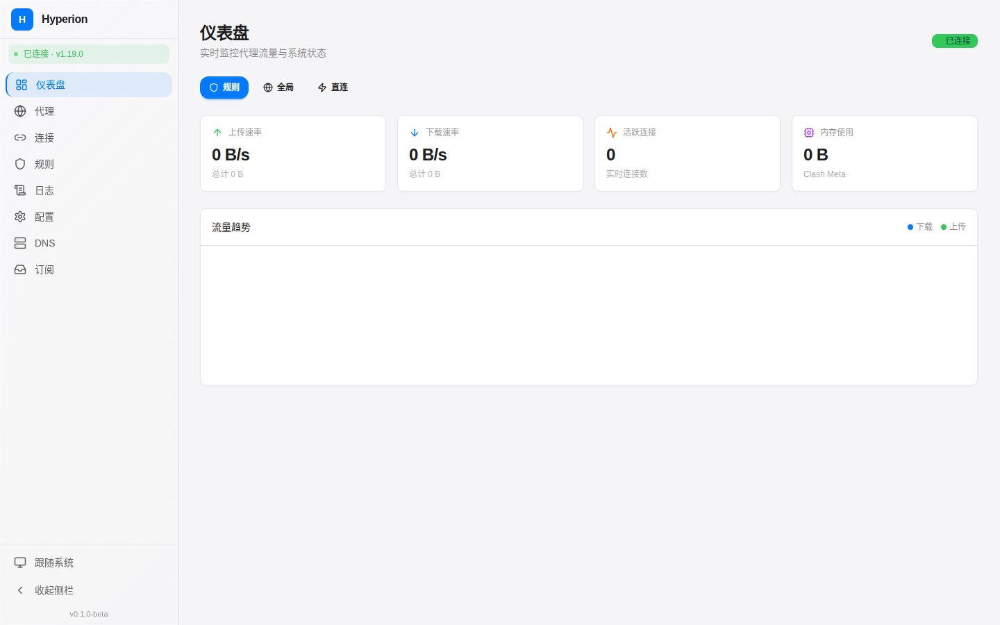
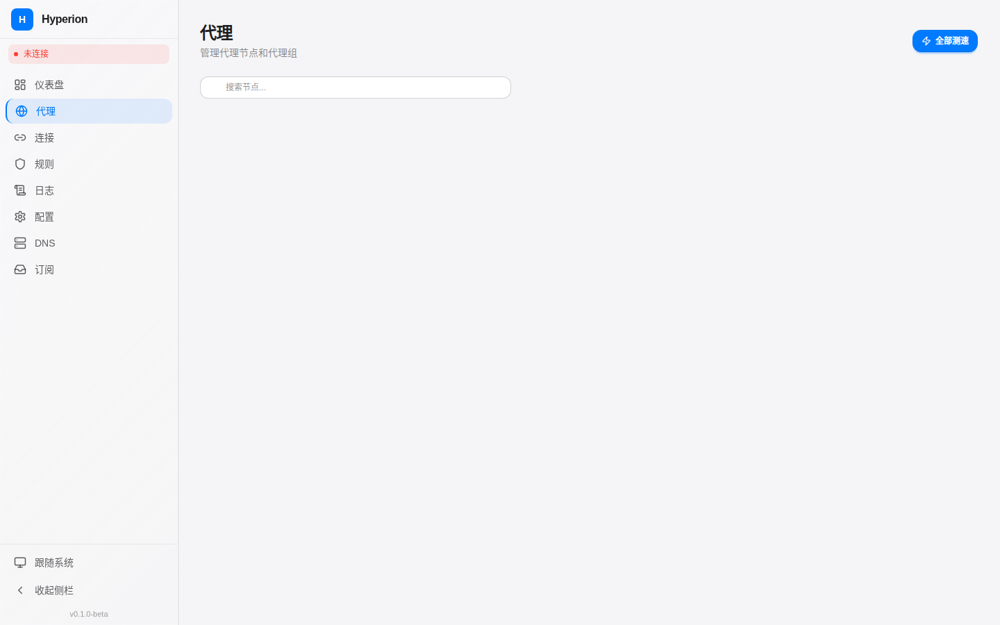
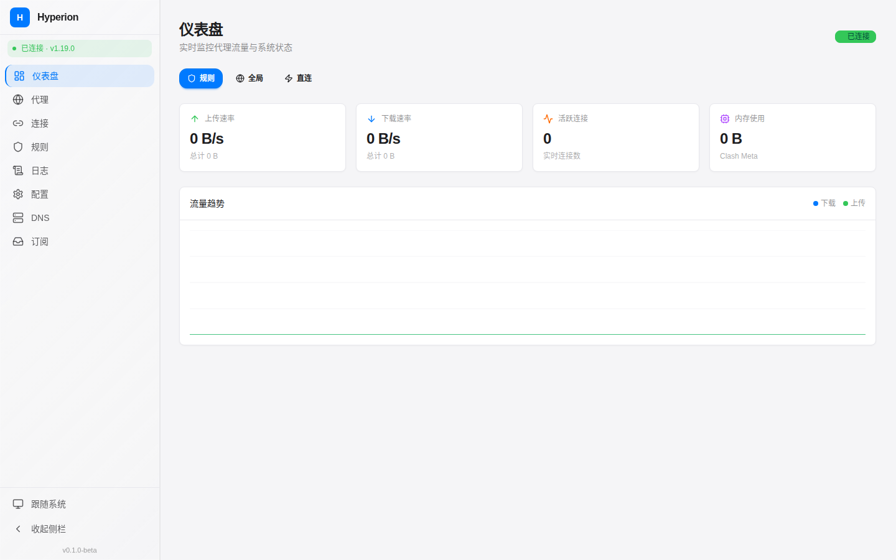
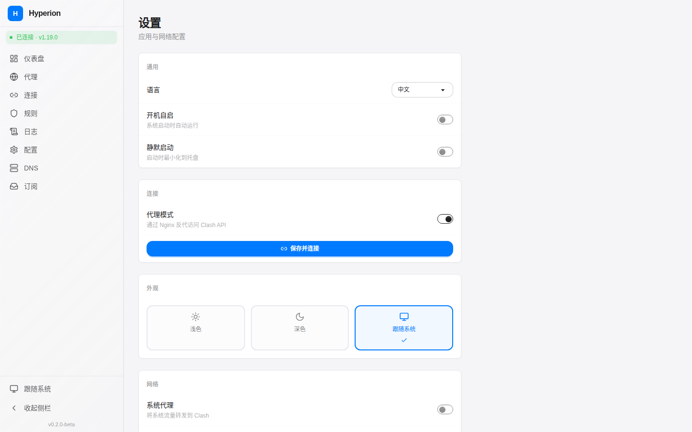
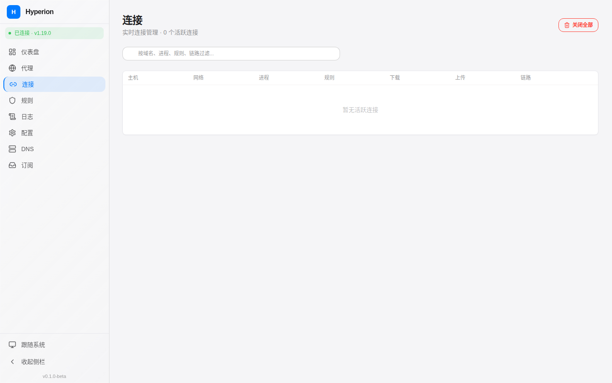
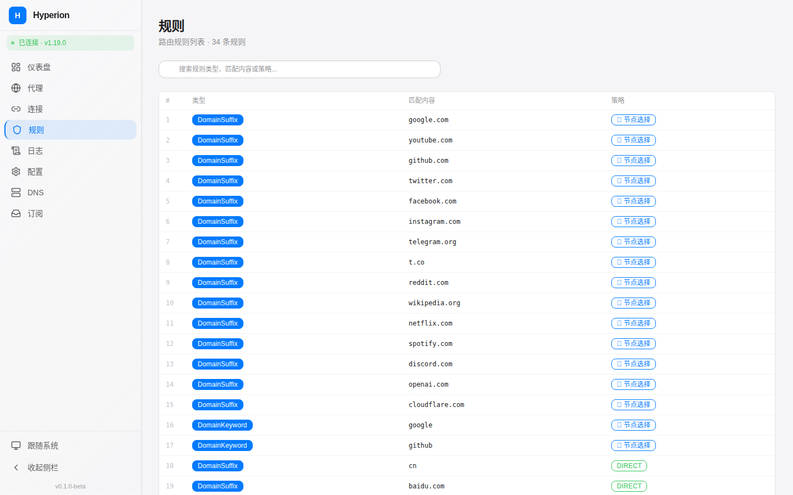
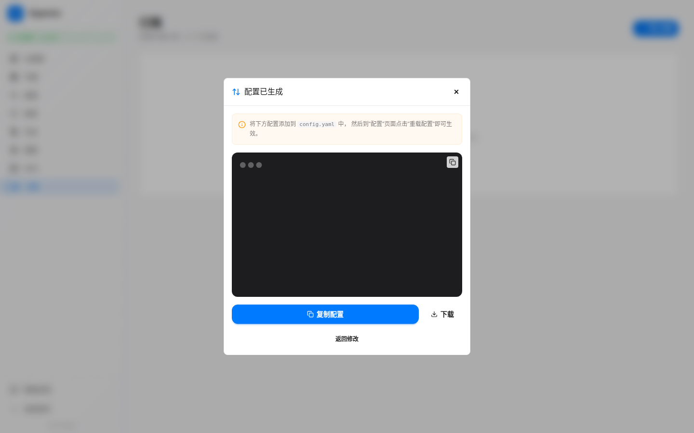

<div align="center">


# Hyperion

**新一代 Clash 内核网页管理面板**

现代化、高性能的代理管理界面 | Apple 设计语言 | 实时光效动画

[](https://github.com/Qing060325/Hyperion/releases)
[](LICENSE)
[](https://www.solidjs.com/)
[]()

[在线预览](https://github.com/Qing060325/Hyperion# screenshots) · [安装指南](#快速开始) · [API 文档](#clash-api-通信)

</div>

---

## 📖 项目介绍

**Hyperion（海珀利昂）** — 取自希腊神话中的光明泰坦神，专为 [Hades](https://github.com/Qing060325/Hades) / Clash 代理内核打造的现代化 Web 管理面板。

> 💡 **Hyperion + Hades = 完整的代理解决方案**
> - Hades 提供高性能代理内核
> - Hyperion 提供直观的 Web 管理界面

### ✨ 设计亮点

| 特性 | 说明 |
|------|------|
| 🎨 **Apple 设计语言** | 简洁优雅的界面，圆角、阴影、毛玻璃效果 |
| 🌓 **深色/浅色主题** | 自动跟随系统或手动切换 |
| ⚡ **实时光效** | Canvas 渲染的流量图表，辉光动效 |
| 📱 **响应式布局** | 完美适配桌面、平板、手机 |
| 🎯 **零学习成本** | 直观的操作界面，无需记忆命令 |

---

## 📸 界面预览

<div align="center">

| 仪表盘 (深色) | 代理管理 (深色) |
|:--:|:--:|
|  |  |

| 仪表盘 (浅色) | 设置页面 |
|:--:|:--:|
|  |  |

</div>

<details>
<summary>查看更多截图</summary>

| 连接管理 | 规则编辑 |
|:--:|:--:|
|  |  |

| 订阅管理 | Hades 集成 |
|:--:|:--:|
|  |  |

</details>

---

## 🚀 快速开始

### 方式一：Docker Compose（推荐）

```bash
# 克隆仓库
git clone https://github.com/Qing060325/Hyperion.git
cd Hyperion

# 启动服务
docker compose up -d

# 访问 http://localhost:8080
```

### 方式二：一键安装脚本

```bash
curl -fsSL https://raw.githubusercontent.com/Qing060325/Hyperion/main/install.sh | sudo bash
```

### 方式三：手动部署

```bash
# 1. 克隆仓库
git clone https://github.com/Qing060325/Hyperion.git
cd Hyperion

# 2. 安装依赖
pnpm install

# 3. 配置代理 API
# 编辑 .env 文件，设置 Hades/Clash API 地址
cp .env.example .env

# 4. 构建并运行
pnpm build
# 或使用 Docker
docker build -t hyperion .
docker run -d -p 8080:80 hyperion
```

---

## 🔧 配置说明

### 连接到 Hades/Clash

Hyperion 通过 RESTful API 和 WebSocket 与代理内核通信：

| 配置项 | 默认值 | 说明 |
|--------|--------|------|
| API 地址 | `127.0.0.1` | Hades/Clash API 地址 |
| API 端口 | `9090` | Hades/Clash API 端口 |
| 密钥 | 空 | 如果设置了 secret，需要填写 |
| 使用代理 | 开启 | 通过前端代理转发 API 请求 |

### Docker Compose 完整配置

```yaml
version: '3.8'

services:
  hyperion:
    build: .
    container_name: hyperion
    ports:
      - "8080:8080"
    environment:
      - CLASH_API_HOST=hades  # Hades 服务名
      - CLASH_API_PORT=9090
    networks:
      - proxy-network
    depends_on:
      - hades

  hades:
    image: ghcr.io/qing060325/hades:latest
    container_name: hades
    ports:
      - "7890:7890"  # 代理端口
      - "9090:9090"  # API 端口
    volumes:
      - ./config:/etc/hades
    networks:
      - proxy-network

networks:
  proxy-network:
    driver: bridge
```

---

## 📦 核心功能

### 📊 仪表盘
- 实时流量图表（上传/下载双通道）
- 运行状态监控（内存、连接数、运行时间）
- 代理模式一键切换（规则/全局/直连）

### 🌐 代理管理
- 代理组层级结构展示
- 节点延迟测试（颜色编码）
- 拖拽排序节点
- 节点搜索过滤

### 🔗 连接管理
- WebSocket 实时连接列表
- 多维度排序和过滤
- 一键关闭连接
- 代理链路追踪

### 📋 规则管理
- 规则列表展示（按类型着色）
- 可视化规则编辑器
- 规则拖拽排序
- 规则集管理

### 📝 日志系统
- WebSocket 实时日志
- 四级日志过滤（Debug/Info/Warning/Error）
- 关键词搜索
- 日志导出

### ⚙️ 系统设置
- 主题切换（深色/浅色/跟随系统）
- 语言切换（中文/英文）
- API 连接配置
- 全局快捷键
- TUN 模式开关

---

## 🛠️ 技术栈

| 技术 | 版本 | 说明 |
|------|------|------|
| [SolidJS](https://www.solidjs.com/) | 1.9 | 细粒度响应式框架 |
| [TypeScript](https://www.typescriptlang.org/) | 5.7 | 类型安全 |
| [Vite](https://vitejs.dev/) | 6.0 | 极速构建工具 |
| [Tailwind CSS](https://tailwindcss.com/) | 4.0 | 原子化 CSS |
| [DaisyUI](https://daisyui.com/) | 5.0 | Tailwind 组件库 |
| [@dnd-kit](https://dndkit.com/) | - | 拖拽排序 |

---

## 🏗️ 项目结构

```
Hyperion/
├── src/
│   ├── pages/           # 页面组件
│   │   ├── Dashboard.tsx      # 仪表盘
│   │   ├── Proxies.tsx        # 代理管理
│   │   ├── Connections.tsx    # 连接管理
│   │   ├── Rules.tsx          # 规则管理
│   │   ├── Logs.tsx           # 日志
│   │   ├── Subscriptions.tsx  # 订阅管理
│   │   └── Settings.tsx       # 系统设置
│   ├── components/      # 通用组件
│   ├── services/        # API 服务
│   ├── stores/          # 状态管理
│   └── types/           # TypeScript 类型
├── config/              # 配置文件
├── screenshots/         # 项目截图
└── docs/                # 文档
```

---

## 🔌 Clash API 通信

Hyperion 通过以下端点与 Hades/Clash 通信：

**RESTful API**

| 方法 | 路径 | 功能 |
|------|------|------|
| GET | `/version` | 获取版本信息 |
| GET | `/proxies` | 获取代理列表 |
| PUT | `/proxies/{name}` | 切换节点 |
| GET | `/connections` | 获取连接列表 |
| DELETE | `/connections` | 关闭所有连接 |

**WebSocket 流**

| 端点 | 数据 |
|------|------|
| `/traffic` | 实时流量速率 |
| `/logs` | 日志推送 |
| `/connections` | 连接更新 |

---

## 🔄 与 Hades 集成

Hyperion 完美配合 [Hades](https://github.com/Qing060325/Hades) 代理内核：

```bash
# 1. 安装 Hades
curl -fsSL https://raw.githubusercontent.com/Qing060325/Hades/main/hades_manager.sh | sudo bash

# 2. 部署 Hyperion
curl -fsSL https://raw.githubusercontent.com/Qing060325/Hyperion/main/install.sh | sudo bash

# 3. 访问 Hyperion 面板配置 Hades 连接
# 默认地址: http://localhost:8080
```

---

## 📚 相关项目

| 项目 | 说明 | 链接 |
|------|------|------|
| **Hades** | 高性能代理内核（Go） | [GitHub](https://github.com/Qing060325/Hades) |
| **Hyperion** | Web 管理面板（本仓库） | [GitHub](https://github.com/Qing060325/Hyperion) |

---

## 🤝 贡献指南

1. Fork 本仓库
2. 创建功能分支：`git checkout -b feature/xxx`
3. 提交更改：`git commit -m 'Add xxx'`
4. 推送分支：`git push origin feature/xxx`
5. 提交 Pull Request

---

## 📄 许可证

[MIT License](LICENSE)

---

<div align="center">

**Hyperion** — 以光明之名，掌控网络之流

Made with ❤️ by [Qing060325](https://github.com/Qing060325)

</div>
